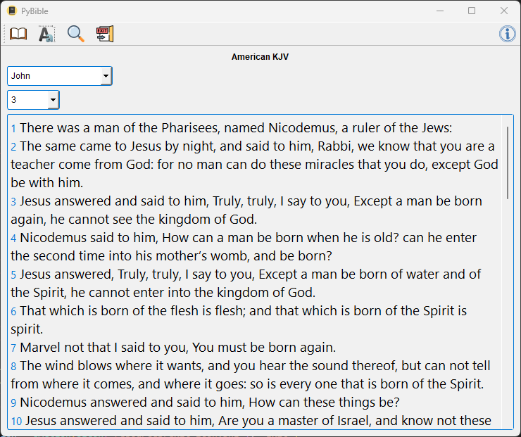

  # PyBible 📝  
  Simple Python app read XML Bible files.

  Version 1.1.0

  #### Three Bibles are included:
  - King James Version
  - American King James Version
  - New International Version
      
  ## Screen shots
  

  
  ## Imports ✨  
  In your virtual environment:

    `pip install pyside6`

  ## Get Started 🚀  
  
    `python pybible.pyw`
  
  ## TODO: ✨ 
 - Text to speech
 - Favorites
 - Search  

  ##
  ## License: MIT